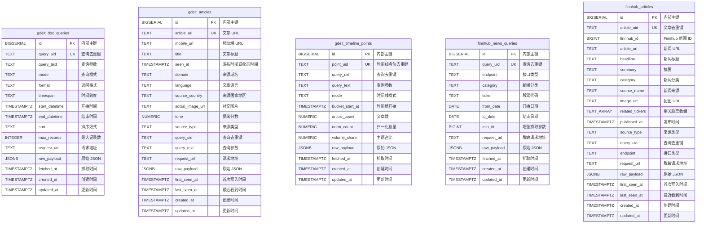

# 数据库 ER 模型

生成依据：`migrations/*.sql` 和 `src/usstock/db/migrations.py` 中的迁移记录表定义。

注意：当前数据库设计明确不使用外键约束。本文中的连线均为应用层逻辑关联，用于理解数据流和查询关系，不代表数据库实际 FK。

## 图例

- `PK`：主键。
- `UK`：唯一索引或唯一业务键。
- `TEXT_ARRAY`：PostgreSQL `TEXT[]`。
- `JSONB`：PostgreSQL JSONB 扩展字段。
- 复合唯一索引写在字段注释或关系说明中。

## 逻辑关系总览

```mermaid
erDiagram
    stock_universe {
        TEXT ticker PK "股票代码"
        TEXT sec_cik "SEC CIK"
    }

    schema_migrations {
        TEXT version PK "迁移版本"
    }

    sec_company_registry {
        BIGSERIAL id PK "内部主键"
        TEXT cik "SEC CIK"
        TEXT ticker "股票代码"
    }

    sec_company_submissions {
        BIGSERIAL id PK "内部主键"
        TEXT cik UK "SEC CIK"
        TEXT ticker "股票代码"
    }

    sec_filings {
        BIGSERIAL id PK "内部主键"
        TEXT accession_number UK "公告编号"
        TEXT cik "SEC CIK"
        TEXT ticker "股票代码"
    }

    sec_filing_documents {
        BIGSERIAL id PK "内部主键"
        TEXT accession_number "公告编号"
        TEXT document_name "文档名"
    }

    sec_company_facts {
        BIGSERIAL id PK "内部主键"
        TEXT cik UK "SEC CIK"
        TEXT ticker "股票代码"
    }

    sec_financial_facts {
        BIGSERIAL id PK "内部主键"
        TEXT fact_uid UK "财务事实去重键"
        TEXT cik "SEC CIK"
        TEXT ticker "股票代码"
        TEXT accession_number "公告编号"
    }

    gdelt_doc_queries {
        BIGSERIAL id PK "内部主键"
        TEXT query_uid UK "查询去重键"
    }

    gdelt_articles {
        BIGSERIAL id PK "内部主键"
        TEXT article_url UK "文章 URL"
        TEXT query_uid "查询去重键"
    }

    gdelt_timeline_points {
        BIGSERIAL id PK "内部主键"
        TEXT point_uid UK "点位去重键"
        TEXT query_uid "查询去重键"
    }

    finnhub_news_queries {
        BIGSERIAL id PK "内部主键"
        TEXT query_uid UK "查询去重键"
        TEXT ticker "股票代码"
    }

    finnhub_articles {
        BIGSERIAL id PK "内部主键"
        TEXT article_uid UK "文章去重键"
        TEXT query_uid "查询去重键"
        TEXT_ARRAY related_tickers "相关股票数组"
    }

    market_topics {
        BIGSERIAL id PK "内部主键"
        TEXT topic_slug UK "主题标识"
    }

    topic_mentions {
        BIGSERIAL id PK "内部主键"
        TEXT mention_uid UK "提及去重键"
        TEXT topic_slug "主题标识"
        TEXT ticker "股票代码"
        TEXT source_type "来源类型"
        TEXT source_uid "来源唯一标识"
    }

    daily_candidate_scores {
        BIGSERIAL id PK "内部主键"
        DATE run_date "运行日期"
        TEXT ticker "股票代码"
        TEXT primary_topic_slug "主主题"
        TEXT_ARRAY topic_slugs "主题数组"
    }

    daily_watchlists {
        BIGSERIAL id PK "内部主键"
        TEXT watchlist_uid UK "观察清单去重键"
        DATE run_date "运行日期"
        TEXT profile "配置"
    }

    market_topic_candidates {
        BIGSERIAL id PK "内部主键"
        TEXT candidate_slug UK "候选主题标识"
        TEXT matched_topic_slug "匹配正式主题"
        TEXT_ARRAY ticker_hints "相关股票数组"
    }

    daily_analysis_reports {
        BIGSERIAL id PK "内部主键"
        TEXT report_uid UK "报告去重键"
        TEXT source_watchlist_uid "来源观察清单"
        DATE run_date "报告日期"
        TEXT profile "配置"
    }

    market_daily_prices {
        BIGSERIAL id PK "内部主键"
        TEXT ticker "股票代码"
        DATE price_date "交易日期"
        TEXT data_source "行情来源"
    }

    daily_candidate_performance {
        BIGSERIAL id PK "内部主键"
        TEXT performance_uid UK "复盘去重键"
        TEXT report_uid "来源报告"
        TEXT ticker "股票代码"
        DATE run_date "日报日期"
    }

    stock_universe ||--o{ sec_company_registry : ticker
    stock_universe }o--o{ sec_company_registry : sec_cik_to_cik
    sec_company_registry ||--o{ sec_company_submissions : cik
    sec_company_registry ||--o{ sec_filings : cik
    sec_filings ||--o{ sec_filing_documents : accession_number
    sec_company_registry ||--o{ sec_company_facts : cik
    sec_company_facts ||--o{ sec_financial_facts : cik
    sec_filings ||--o{ sec_financial_facts : accession_number

    gdelt_doc_queries ||--o{ gdelt_articles : query_uid
    gdelt_doc_queries ||--o{ gdelt_timeline_points : query_uid
    finnhub_news_queries ||--o{ finnhub_articles : query_uid
    stock_universe }o--o{ finnhub_articles : related_tickers

    market_topics ||--o{ topic_mentions : topic_slug
    stock_universe ||--o{ topic_mentions : ticker
    finnhub_articles ||--o{ topic_mentions : article_uid_to_source_uid
    gdelt_articles ||--o{ topic_mentions : article_url_to_source_uid
    sec_filings ||--o{ topic_mentions : accession_to_source_uid

    market_topics }o--o{ daily_candidate_scores : topic_slugs
    stock_universe ||--o{ daily_candidate_scores : ticker
    daily_watchlists ||--o{ daily_candidate_scores : run_date_profile
    market_topics ||--o{ market_topic_candidates : matched_topic_slug
    market_topic_candidates }o--o{ stock_universe : ticker_hints

    daily_watchlists ||--o{ daily_analysis_reports : source_watchlist_uid
    daily_analysis_reports ||--o{ daily_candidate_performance : report_uid
    daily_candidate_scores ||--o{ daily_candidate_performance : run_date_ticker
    stock_universe ||--o{ market_daily_prices : ticker
    stock_universe ||--o{ daily_candidate_performance : ticker
    market_daily_prices ||--o{ daily_candidate_performance : ticker_date
```

## 基础与 SEC 字段模型

```mermaid
erDiagram
    schema_migrations {
        TEXT version PK "迁移版本号"
        TEXT name "迁移名称"
        TEXT checksum_sha256 "迁移校验和"
        TIMESTAMPTZ applied_at "应用时间"
        INTEGER execution_time_ms "执行耗时毫秒"
    }

    stock_universe {
        TEXT ticker PK "股票代码"
        TEXT company_name "公司名称"
        TEXT exchange "交易所"
        TEXT sector "板块"
        TEXT industry "行业"
        TEXT country "国家地区"
        TEXT currency "交易货币"
        TEXT asset_type "资产类型"
        TEXT sec_cik "SEC CIK"
        TEXT isin UK "ISIN"
        TEXT figi UK "FIGI"
        TEXT cusip "CUSIP"
        BOOLEAN is_active "是否启用"
        BOOLEAN is_sp500 "是否标普500"
        BOOLEAN is_nasdaq100 "是否纳指100"
        BOOLEAN is_china_adr "是否中概 ADR"
        BOOLEAN is_manual_watchlist "是否人工观察"
        TEXT business_description "业务描述"
        NUMERIC market_cap_usd "美元市值"
        NUMERIC avg_volume_30d "30日均量"
        NUMERIC last_price "最新价格"
        TEXT data_source "数据来源"
        TEXT source_url "来源地址"
        TIMESTAMPTZ first_seen_at "首次发现时间"
        TIMESTAMPTZ last_refreshed_at "最近刷新时间"
        JSONB metadata "扩展元数据"
        TEXT notes "人工备注"
        TIMESTAMPTZ created_at "创建时间"
        TIMESTAMPTZ updated_at "更新时间"
    }

    sec_company_registry {
        BIGSERIAL id PK "内部主键"
        TEXT cik "SEC CIK"
        TEXT ticker "股票代码"
        TEXT company_name "SEC 公司名称"
        TEXT exchange "交易所"
        TEXT source_url "来源地址"
        JSONB raw_payload "原始 JSON"
        TIMESTAMPTZ first_seen_at "首次发现时间"
        TIMESTAMPTZ last_refreshed_at "最近刷新时间"
        TIMESTAMPTZ created_at "创建时间"
        TIMESTAMPTZ updated_at "更新时间"
    }

    sec_company_submissions {
        BIGSERIAL id PK "内部主键"
        TEXT cik UK "SEC CIK"
        TEXT ticker "股票代码"
        TEXT company_name "公司名称"
        TEXT sic "SIC 行业代码"
        TEXT sic_description "SIC 行业描述"
        TEXT entity_type "实体类型"
        TEXT fiscal_year_end "财年结束日"
        TEXT state_of_incorporation "注册州"
        TEXT source_url "来源地址"
        JSONB raw_payload "原始 JSON"
        TIMESTAMPTZ fetched_at "抓取时间"
        TIMESTAMPTZ created_at "创建时间"
        TIMESTAMPTZ updated_at "更新时间"
    }

    sec_filings {
        BIGSERIAL id PK "内部主键"
        TEXT cik "SEC CIK"
        TEXT ticker "股票代码"
        TEXT company_name "公司名称"
        TEXT accession_number UK "公告编号"
        TEXT accession_number_no_dash "无横线公告编号"
        TEXT form_type "表单类型"
        DATE filing_date "提交日期"
        DATE report_date "报告期"
        TIMESTAMPTZ acceptance_datetime "SEC 接收时间"
        TEXT act "证券法案分类"
        TEXT file_number "文件编号"
        TEXT film_number "影像编号"
        TEXT items "披露事项"
        BIGINT file_size_bytes "文件大小"
        BOOLEAN is_inline_xbrl "是否 inline XBRL"
        BOOLEAN is_xbrl "是否 XBRL"
        BOOLEAN is_amendment "是否修订公告"
        TEXT primary_document "主文档"
        TEXT primary_doc_description "主文档描述"
        TEXT filing_detail_url "公告详情地址"
        TEXT primary_document_url "主文档地址"
        TEXT source_url "来源地址"
        JSONB raw_payload "原始 JSON"
        TIMESTAMPTZ fetched_at "抓取时间"
        TIMESTAMPTZ created_at "创建时间"
        TIMESTAMPTZ updated_at "更新时间"
    }

    sec_filing_documents {
        BIGSERIAL id PK "内部主键"
        TEXT cik "SEC CIK"
        TEXT ticker "股票代码"
        TEXT accession_number "公告编号"
        TEXT accession_number_no_dash "无横线公告编号"
        INTEGER document_sequence "文档序号"
        TEXT document_name "文档名"
        TEXT document_type "文档类型"
        TEXT document_description "文档描述"
        TEXT document_url "文档地址"
        TEXT content_type "内容类型"
        BIGINT file_size_bytes "文件大小"
        TEXT local_raw_path "本地原始路径"
        BOOLEAN is_primary "是否主文档"
        BOOLEAN is_xbrl "是否 XBRL 文档"
        JSONB raw_payload "原始 JSON"
        TIMESTAMPTZ fetched_at "抓取时间"
        TIMESTAMPTZ created_at "创建时间"
        TIMESTAMPTZ updated_at "更新时间"
    }

    sec_company_facts {
        BIGSERIAL id PK "内部主键"
        TEXT cik UK "SEC CIK"
        TEXT ticker "股票代码"
        TEXT company_name "公司名称"
        TEXT entity_name "SEC 实体名称"
        TEXT source_url "来源地址"
        JSONB raw_payload "原始 JSON"
        TIMESTAMPTZ fetched_at "抓取时间"
        TIMESTAMPTZ created_at "创建时间"
        TIMESTAMPTZ updated_at "更新时间"
    }

    sec_financial_facts {
        BIGSERIAL id PK "内部主键"
        TEXT fact_uid UK "财务事实去重键"
        TEXT cik "SEC CIK"
        TEXT ticker "股票代码"
        TEXT accession_number "公告编号"
        TEXT taxonomy "XBRL 分类体系"
        TEXT concept "XBRL 概念"
        TEXT label "概念名称"
        TEXT description "概念说明"
        TEXT unit "单位"
        INTEGER fiscal_year "财年"
        TEXT fiscal_period "财报期间"
        TEXT form_type "表单类型"
        DATE filed_date "提交日期"
        DATE start_date "期间开始"
        DATE end_date "期间结束"
        TEXT frame "报告框架"
        NUMERIC value_numeric "数值"
        TEXT value_text "文本值"
        JSONB raw_payload "原始 JSON"
        TIMESTAMPTZ extracted_at "抽取时间"
        TIMESTAMPTZ created_at "创建时间"
        TIMESTAMPTZ updated_at "更新时间"
    }
```

## 新闻数据源字段模型

## 发现、报告与复盘字段模型

```mermaid
erDiagram
    market_topics {
        BIGSERIAL id PK "内部主键"
        TEXT topic_slug UK "主题标识"
        TEXT topic_name "主题名称"
        TEXT gdelt_query "GDELT 查询"
        TEXT_ARRAY keywords "关键词数组"
        TEXT_ARRAY sectors "相关板块数组"
        TEXT_ARRAY ticker_hints "种子股票数组"
        INTEGER priority "同步优先级"
        BOOLEAN is_active "是否启用"
        TEXT data_source "主题来源"
        JSONB metadata "扩展元数据"
        TIMESTAMPTZ first_seen_at "首次写入时间"
        TIMESTAMPTZ last_refreshed_at "最近刷新时间"
        TIMESTAMPTZ created_at "创建时间"
        TIMESTAMPTZ updated_at "更新时间"
    }

    topic_mentions {
        BIGSERIAL id PK "内部主键"
        TEXT mention_uid UK "提及去重键"
        TEXT topic_slug "主题标识"
        TEXT ticker "股票代码"
        TEXT source_type "来源类型"
        TEXT source_uid "来源唯一标识"
        TEXT source_title "来源标题"
        TEXT source_url "来源 URL"
        TIMESTAMPTZ published_at "来源发布时间"
        NUMERIC relevance_score "相关性分数"
        JSONB evidence "匹配证据"
        TIMESTAMPTZ detected_at "检测时间"
        TIMESTAMPTZ created_at "创建时间"
        TIMESTAMPTZ updated_at "更新时间"
    }

    daily_candidate_scores {
        BIGSERIAL id PK "内部主键"
        DATE run_date "运行日期"
        TEXT ticker "股票代码"
        TEXT company_name "公司名称"
        NUMERIC score "综合评分"
        INTEGER rank "当日排名"
        TEXT_ARRAY topic_slugs "触发主题数组"
        TEXT primary_topic_slug "主触发主题"
        NUMERIC news_score "新闻分"
        NUMERIC gdelt_score "GDELT 分"
        NUMERIC sec_score "SEC 分"
        NUMERIC fundamental_score "基本面分"
        NUMERIC liquidity_score "流动性分"
        INTEGER finnhub_article_count "Finnhub 文章数"
        INTEGER gdelt_article_count "GDELT 文章数"
        INTEGER sec_filing_count "SEC 公告数"
        TIMESTAMPTZ latest_news_at "最新新闻时间"
        DATE latest_filing_date "最新公告日期"
        TEXT action_bias "建议动作"
        JSONB rationale "评分原因"
        TIMESTAMPTZ generated_at "生成时间"
        TIMESTAMPTZ created_at "创建时间"
        TIMESTAMPTZ updated_at "更新时间"
    }

    daily_watchlists {
        BIGSERIAL id PK "内部主键"
        TEXT watchlist_uid UK "观察清单去重键"
        DATE run_date "运行日期"
        TEXT profile "配置名称"
        INTEGER candidate_count "候选数量"
        TEXT summary "摘要"
        JSONB raw_payload "完整结果 JSON"
        TIMESTAMPTZ generated_at "生成时间"
        TIMESTAMPTZ created_at "创建时间"
        TIMESTAMPTZ updated_at "更新时间"
    }

    market_topic_candidates {
        BIGSERIAL id PK "内部主键"
        TEXT candidate_slug UK "候选主题标识"
        TEXT topic_name "候选主题名称"
        TEXT gdelt_query "建议 GDELT 查询"
        TEXT_ARRAY keywords "关键词数组"
        TEXT_ARRAY ticker_hints "相关股票数组"
        TEXT_ARRAY source_types "来源类型数组"
        INTEGER article_count "文章数"
        INTEGER source_count "来源数"
        INTEGER ticker_count "股票数"
        NUMERIC trend_score "趋势分"
        NUMERIC novelty_score "新颖度分"
        TEXT status "候选状态"
        TEXT matched_topic_slug "匹配正式主题"
        INTEGER extraction_window_hours "抽取窗口小时"
        JSONB evidence "证据列表"
        JSONB metadata "扩展元数据"
        TIMESTAMPTZ first_seen_at "首次发现时间"
        TIMESTAMPTZ last_seen_at "最近发现时间"
        TIMESTAMPTZ promoted_at "晋升时间"
        TIMESTAMPTZ rejected_at "拒绝时间"
        TIMESTAMPTZ created_at "创建时间"
        TIMESTAMPTZ updated_at "更新时间"
    }

    daily_analysis_reports {
        BIGSERIAL id PK "内部主键"
        TEXT report_uid UK "报告去重键"
        DATE run_date "报告日期"
        TEXT profile "配置名称"
        TEXT report_type "报告类型"
        INTEGER candidate_count "候选数量"
        TEXT llm_provider "LLM 提供方"
        TEXT llm_model "LLM 模型"
        BOOLEAN llm_used "是否使用 LLM"
        TEXT status "报告状态"
        TEXT summary "报告摘要"
        TEXT markdown_body "Markdown 正文"
        JSONB structured_payload "结构化报告 JSON"
        TEXT source_watchlist_uid "来源观察清单"
        TIMESTAMPTZ generated_at "生成时间"
        TIMESTAMPTZ created_at "创建时间"
        TIMESTAMPTZ updated_at "更新时间"
    }

    market_daily_prices {
        BIGSERIAL id PK "内部主键"
        TEXT ticker "股票代码"
        DATE price_date "交易日期"
        NUMERIC open_price "开盘价"
        NUMERIC high_price "最高价"
        NUMERIC low_price "最低价"
        NUMERIC close_price "收盘价"
        NUMERIC adjusted_close_price "复权收盘价"
        NUMERIC volume "成交量"
        TEXT currency "货币"
        TEXT data_source "行情来源"
        TEXT source_uid "来源去重键"
        JSONB metadata "扩展元数据"
        TIMESTAMPTZ created_at "创建时间"
        TIMESTAMPTZ updated_at "更新时间"
    }

    daily_candidate_performance {
        BIGSERIAL id PK "内部主键"
        TEXT performance_uid UK "表现记录去重键"
        DATE run_date "日报日期"
        TEXT profile "配置名称"
        TEXT report_uid "来源报告"
        TEXT ticker "股票代码"
        TEXT company_name "公司名称"
        INTEGER rank "日报排名"
        NUMERIC score "日报评分"
        TEXT attention_label "关注级别"
        TEXT event_type "事件类型"
        TEXT risk_level "风险等级"
        TEXT primary_topic_slug "主触发主题"
        TEXT_ARRAY topic_slugs "主题数组"
        TEXT action_bias "建议动作"
        DATE entry_date "入场参考日"
        NUMERIC entry_close "入场参考价"
        TEXT price_source "行情来源"
        DATE horizon_1d_date "1日窗口日期"
        NUMERIC horizon_1d_close "1日窗口收盘价"
        NUMERIC return_1d_pct "1日收益率"
        NUMERIC max_drawdown_1d_pct "1日最大回撤"
        NUMERIC max_runup_1d_pct "1日最大上涨"
        DATE horizon_5d_date "5日窗口日期"
        NUMERIC horizon_5d_close "5日窗口收盘价"
        NUMERIC return_5d_pct "5日收益率"
        NUMERIC max_drawdown_5d_pct "5日最大回撤"
        NUMERIC max_runup_5d_pct "5日最大上涨"
        DATE horizon_20d_date "20日窗口日期"
        NUMERIC horizon_20d_close "20日窗口收盘价"
        NUMERIC return_20d_pct "20日收益率"
        NUMERIC max_drawdown_20d_pct "20日最大回撤"
        NUMERIC max_runup_20d_pct "20日最大上涨"
        TEXT performance_status "计算状态"
        TEXT missing_reason "缺失原因"
        JSONB details "计算明细"
        TIMESTAMPTZ computed_at "计算时间"
        TIMESTAMPTZ created_at "创建时间"
        TIMESTAMPTZ updated_at "更新时间"
    }
```

## 关键逻辑关联说明

| 关系 | 关联字段 | 说明 |
| --- | --- | --- |
| 股票池到 SEC 数据 | `stock_universe.ticker = sec_* .ticker` 或 `stock_universe.sec_cik = sec_* .cik` | SEC 相关表同时保留 `ticker` 和 `cik`，应用层按可用字段匹配。 |
| SEC 公告到公告文档 | `sec_filings.accession_number = sec_filing_documents.accession_number` | 一个 filing 可包含主文档、XBRL 和附件文档。 |
| SEC 公告到财务事实 | `sec_filings.accession_number = sec_financial_facts.accession_number` | 财务事实可能来自 company facts，也可能能回连到具体 filing。 |
| GDELT 查询到文章/时间线 | `gdelt_doc_queries.query_uid = gdelt_articles.query_uid`、`gdelt_timeline_points.query_uid` | `query_uid` 是应用层生成的查询去重键。 |
| Finnhub 查询到文章 | `finnhub_news_queries.query_uid = finnhub_articles.query_uid` | `query_uid` 是应用层生成的查询去重键。 |
| 新闻文章到股票 | `finnhub_articles.related_tickers`、`topic_mentions.ticker` | Finnhub 文章使用数组保存相关股票，主题提及表保存标准化后的 ticker。 |
| 来源到主题提及 | `topic_mentions.source_type + source_uid` | 多态来源，可能指向 Finnhub 文章、GDELT 文章、SEC filing 或股票池。 |
| 正式主题到候选评分 | `market_topics.topic_slug` 对应 `daily_candidate_scores.primary_topic_slug/topic_slugs` | 候选股可能由一个或多个主题触发。 |
| 候选主题到正式主题 | `market_topic_candidates.matched_topic_slug = market_topics.topic_slug` | 候选主题审核通过后可晋升或匹配到正式主题。 |
| 观察清单到报告 | `daily_watchlists.watchlist_uid = daily_analysis_reports.source_watchlist_uid` | 日报记录其来源观察清单。 |
| 报告到复盘表现 | `daily_analysis_reports.report_uid = daily_candidate_performance.report_uid` | 候选股表现复盘以日报为来源。 |
| 行情到复盘表现 | `market_daily_prices.ticker + price_date` 对应复盘入场日和各 horizon 日期 | 复盘表使用日线价格计算 1/5/20 个交易日收益和回撤。 |

## 复合唯一索引

| 表 | 复合唯一字段 |
| --- | --- |
| `sec_company_registry` | `(cik, ticker)` |
| `sec_filing_documents` | `(accession_number, document_name)` |
| `daily_candidate_scores` | `(run_date, ticker)` |
| `market_daily_prices` | `(ticker, price_date, data_source)` |

