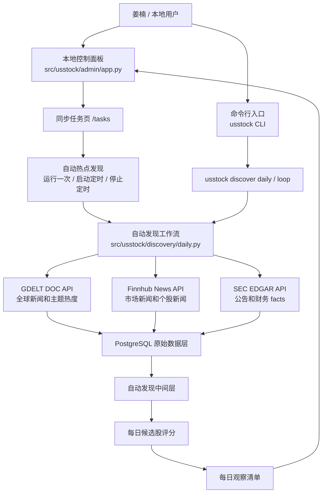
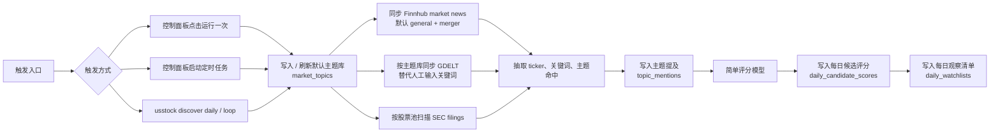
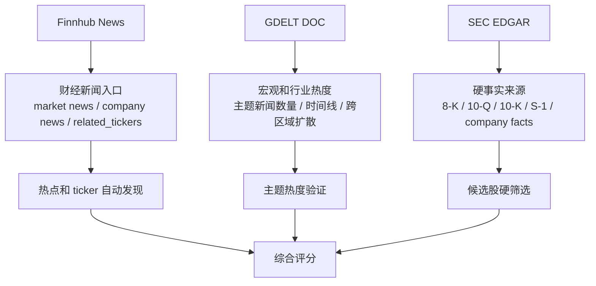
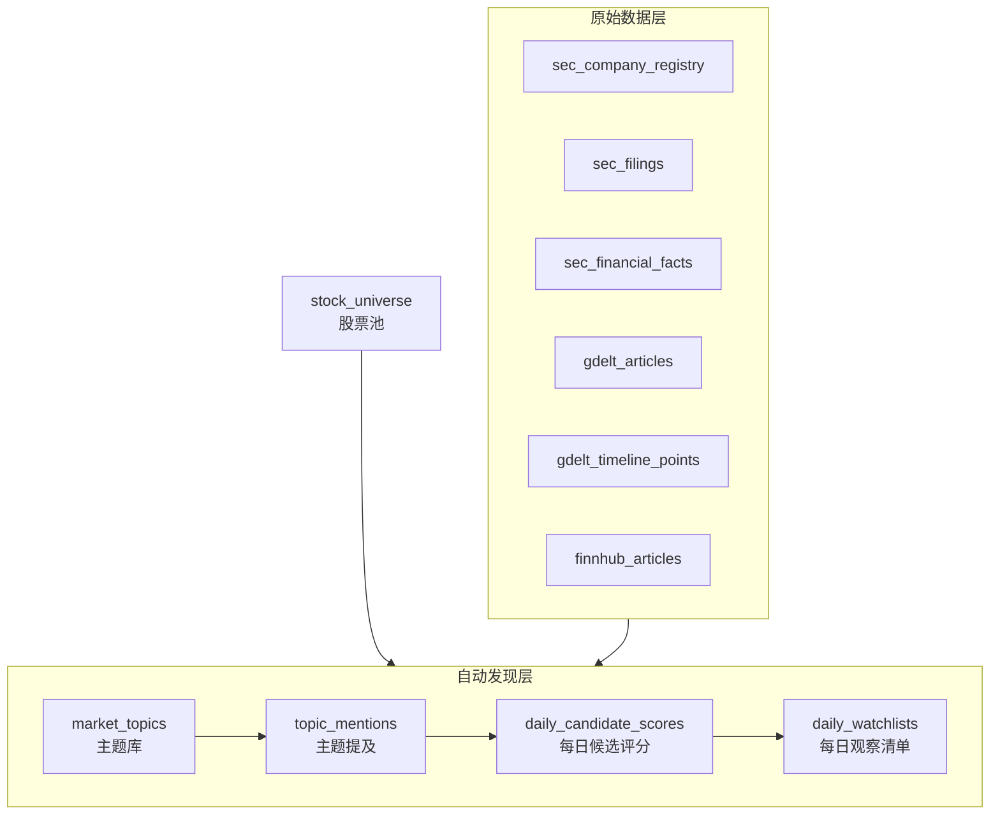
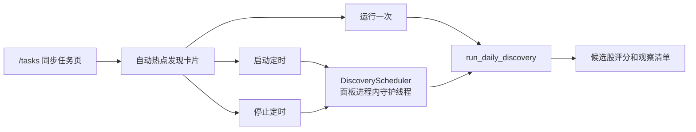

# USStock 项目鸟瞰图

## 项目目标

USStock 是一个面向美股投研的自动发现系统。当前目标是把 SEC、GDELT、Finnhub 等数据源串成一条每日工作流：

- 自动发现市场热点
- 将热点映射到相关美股标的
- 用结构化财务数据做硬筛选
- 后续用 AI 辅助阅读财报文本和新闻材料
- 输出每日候选股评分、观察清单和交易计划

## 总体架构



## 当前自动发现工作流



## 数据源分工



## 数据库分层



## 控制面板任务区



## 当前 CLI 命令

```bash
usstock admin # 启动本地控制面板，默认访问 http://127.0.0.1:7878。
usstock admin --port 7879 # 使用 7879 端口启动控制面板，适合默认端口被占用时使用。
usstock migrate # 执行数据库迁移，创建或更新项目所需表结构。
usstock discover seed-topics # 写入或刷新自动发现使用的默认市场主题库。
usstock discover daily --top-n 25 # 同步数据并运行一次每日热点发现，输出前 25 个候选标的。
usstock discover daily --skip-sync --top-n 25 # 跳过外部数据同步，仅基于库内已有数据重新生成前 25 个候选标的。
usstock discover loop --interval-minutes 60 # 每 60 分钟循环运行一次自动热点发现任务。
```

## 关键文件

- `src/usstock/cli.py`：统一 CLI 入口。
- `src/usstock/admin/app.py`：本地控制面板，包含自动发现按钮和定时任务控制。
- `src/usstock/discovery/daily.py`：自动热点发现、主题映射、评分和观察清单生成。
- `src/usstock/data/gdelt.py`：GDELT DOC API 同步。
- `src/usstock/data/finnhub.py`：Finnhub News API 同步。
- `src/usstock/data/sec.py`：SEC EDGAR 同步。
- `migrations/006_create_discovery_tables.sql`：自动发现相关表结构。

## 当前能力边界

当前版本已经能把“人工输入关键词查新闻”升级为“系统按主题库自动发现热点”。不过它仍是 MVP：

- 定时任务运行在本地控制面板进程内，面板重启后需要重新启动。
- 评分模型是规则模型，适合初筛，不等于交易建议。
- 暂未接入行情异动、技术指标、期权异动和 AI 财报全文阅读。
- 后续可以把控制面板内定时任务升级为 cron、systemd、Celery 或独立 worker。
