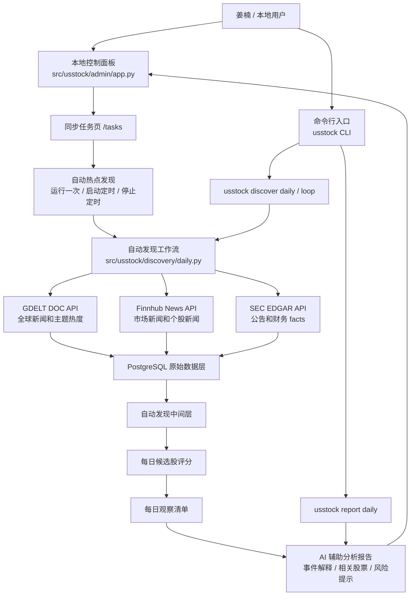
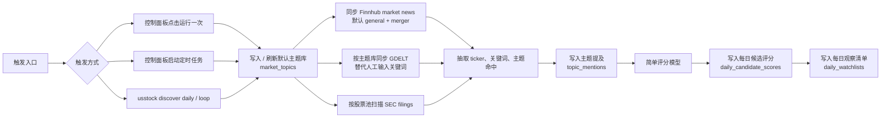
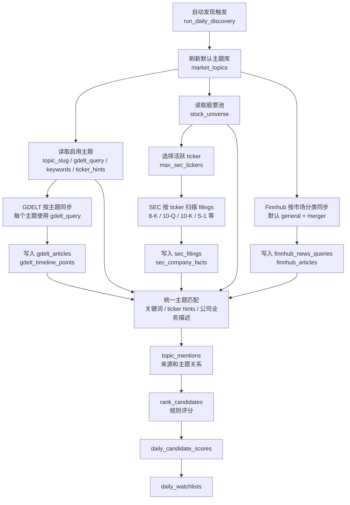
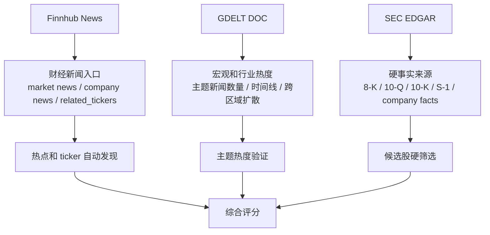
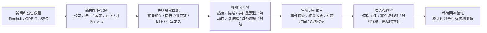
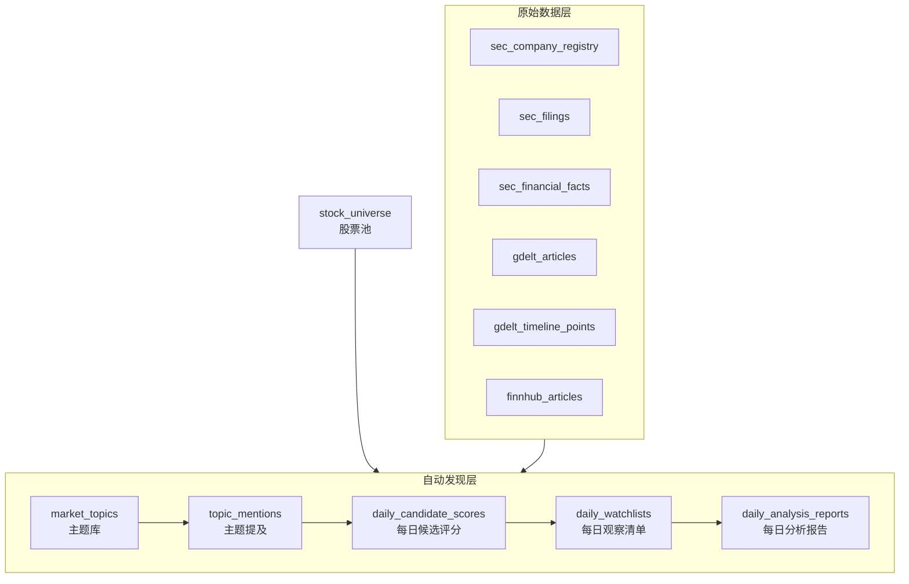
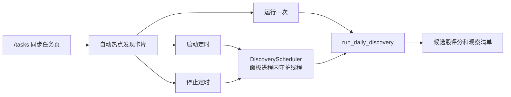

# USStock 项目鸟瞰图

## 项目目标

USStock 是一个面向美股投研的自动发现系统。当前目标是把 SEC、GDELT、Finnhub 等数据源串成一条每日工作流：

- 自动发现市场热点
- 将热点映射到相关美股标的
- 用结构化财务数据做硬筛选
- 后续用 AI 辅助阅读财报文本和新闻材料
- 输出每日候选股评分、观察清单、分析报告和交易计划

## 总体架构



## 当前自动发现工作流



## 同步数据逻辑

自动发现不是所有数据源都按主题同步。当前设计里，只有 GDELT 是直接按主题库同步；Finnhub 和 SEC 先按各自更稳定的维度同步，再回到主题匹配和候选股评分。



### 三类同步维度

- GDELT：按 `market_topics.gdelt_query` 同步，适合捕捉宏观、行业、政策和技术主题热度。
- Finnhub：按 market news 分类同步，默认 `general` 和 `merger`，同步后再用标题、摘要、related_tickers 和主题关键词做映射。
- SEC：按 `stock_universe` 中的活跃 ticker 扫描 filings，同步后再用公告类型、公司信息、主题 ticker hints 和关键词做映射。

### 跳过同步选项

```bash
usstock discover daily --skip-finnhub-sync # 不同步 Finnhub，只用库内已有 Finnhub 数据
usstock discover daily --skip-gdelt-sync # 不同步 GDELT，只用库内已有 GDELT 数据
usstock discover daily --skip-sec-sync # 不同步 SEC，只用库内已有 SEC 数据
usstock discover daily --skip-sync --top-n 25 # 三类外部同步都跳过，只重新评分
```

## 数据源分工



## 分析报告和股票推荐候选池

当前已经可以把抓到的新闻和相关数据推进成“可解释的研究报告系统”。这里的推荐定位为候选池和关注优先级，不直接等同于买卖建议。



### 推荐生成顺序

1. 新闻事件识别：从新闻和公告里提取公司、行业、产品、政策、财报、并购、诉讼、评级、宏观事件等，并判断利好、利空或中性。
2. 关联股票匹配：先匹配新闻中明确出现的上市公司，再扩展到同行、供应链、竞争对手、ETF 和行业龙头，并保留“为什么相关”的解释。
3. 多维度评分：综合新闻热度、情绪方向、事件重要性、股票流动性、近期涨跌幅、估值或财务质量、风险等级。
4. 生成分析报告：输出今日核心事件摘要、相关股票列表、每只股票的关联理由、短期关注点、风险提示和数据时间。
5. 候选推荐而非直接买卖建议：报告表述以“值得关注”“事件驱动强”“短线波动风险高”“基本面支撑较弱”“仅新闻相关，需继续验证”为主。
6. 回测和复盘：沉淀每日评分、报告结论和后续价格表现，用历史数据验证评分模型是否真的有效。

## 数据库分层



## 控制面板任务区



## 当前 CLI 命令

```bash
usstock admin # 启动本地控制面板，默认访问 http://127.0.0.1:7878。
usstock admin --port 7879 # 使用 7879 端口启动控制面板，适合默认端口被占用时使用。
usstock migrate # 执行数据库迁移，创建或更新项目所需表结构。
usstock discover seed-topics # 写入或刷新自动发现使用的默认市场主题库。
usstock discover daily --top-n 25 # 同步数据并运行一次每日热点发现，输出前 25 个候选标的。
usstock discover daily --skip-sync --top-n 25 # 跳过外部数据同步，仅基于库内已有数据重新生成前 25 个候选标的。
usstock report daily --top-n 10 # 基于候选评分和观察清单生成每日分析报告。
usstock report daily --top-n 10 --use-llm --save-markdown # 使用 LLM 增强报告并保存 Markdown。
usstock discover loop --interval-minutes 60 # 每 60 分钟循环运行一次自动热点发现任务。
```

## 关键文件

- `src/usstock/cli.py`：统一 CLI 入口。
- `src/usstock/admin/app.py`：本地控制面板，包含自动发现按钮和定时任务控制。
- `src/usstock/discovery/daily.py`：自动热点发现、主题映射、评分和观察清单生成。
- `src/usstock/reports/daily_report.py`：每日新闻驱动分析报告生成，支持规则版和可选 LLM 增强。
- `src/usstock/data/gdelt.py`：GDELT DOC API 同步。
- `src/usstock/data/finnhub.py`：Finnhub News API 同步。
- `src/usstock/data/sec.py`：SEC EDGAR 同步。
- `migrations/006_create_discovery_tables.sql`：自动发现相关表结构。
- `migrations/010_create_daily_analysis_reports.sql`：每日分析报告落库表结构。

## 当前能力边界

当前版本已经能把“人工输入关键词查新闻”升级为“系统按主题库自动发现热点”。不过它仍是 MVP：

- 定时任务运行在本地控制面板进程内，面板重启后需要重新启动。
- 评分模型和报告基础版本都是规则模型，适合初筛和复盘，不等于交易建议。
- LLM 增强是可选能力，只负责摘要和解释，不覆盖结构化评分。
- 暂未接入行情异动、技术指标、期权异动和 AI 财报全文阅读。
- 后续可以把控制面板内定时任务升级为 cron、systemd、Celery 或独立 worker。
